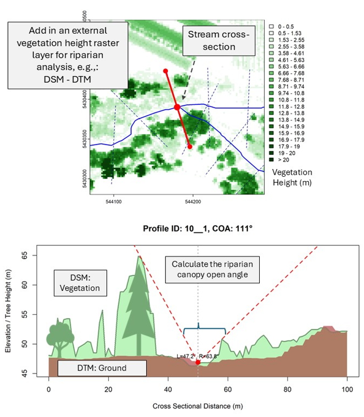

# streamgis

Hydrology, watershed and river bathymetry functions for spatial data in R

### Spatial data  

The 'streamgis' package is intended as a free and readily-available resource for common
functions to support aquatic ecosystem assessments, hydrology and 
other watershed functions with spatial data.

Note that the current version of 'streamgis' is built on 'sp' and 'rgdal' and
will be modified in the near future.

### Installation

`remove.package("streamgis")`
`devtools::install_github("mattjbayly/streamgis")`

### Commonly-used Functions and Workflow

* `points_on_line()` Samples points on stream center line.

* `cross_section_lines()` Create perpendicular Cross-Section Lines.

* `sample_profiles_and_canopy_angle()` Calculate canopy open angle with vegetation height raster or DSM - DTM product.

* `clean_reach_buffer()` Clean buffer along stream cut by cross sections.

* `bcfwa_geometry()` Get the x,y,z geometry from BCFWA streamlines.

### Riparian Analysis

We can bring the functions together in a useful way to calculate various riparian habitat metrics. For example, starting with our stream center line we can use the `points_on_line()`function to sample points along streamline at a specified distance (e.g., sample a point every 20m). `points_on_line()`is similar to QChainage in QGIS, but can work with line geometry that is multipart or has multiple features. After we have sampled our points we can run `cross_section_lines()`to generate cross-sectional profiles along our streamline layer. We can specify the width and other arrtibutes. `cross_section_lines()` returns the bearing of the cross section and streamline. These attributes are useful when thinking about aspect and solar exposure.

Finally, once we have our cross-sectional profiles from `cross_section_lines()`, we can bring in external tree height data, and/or DSM/DTMs (digital surface models / digital terrain models). We can then leverage the `sample_profiles_and_canopy_angle()`to sample points along each cross sectional profile to generate a cross-sectional elevation profile. We can specify point spacing, vertical offsets and other attributes for stream cross sectional analysis. Various other programs like HEC-RAS allow for similar functionality, but `sample_profiles_and_canopy_angle()` may come in useful for custom analyses.

The following example provides similar functionality to [Seixas et al., 2018: Historical and Future Stream Temperature Change Predicted by a Lidar-Based Assessment of Riparian Condition and Channel Width](https://onlinelibrary.wiley.com/doi/10.1111/1752-1688.12655?utm_source=researchgate)

{width=80% fig-align="center"}

### Installation

'streamgis' is only available on GitHub.

The development version can be installed in R with the following code:

`devtools::install_github("mattjbayly/streamgis")`
