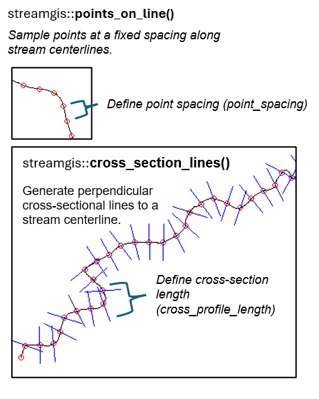
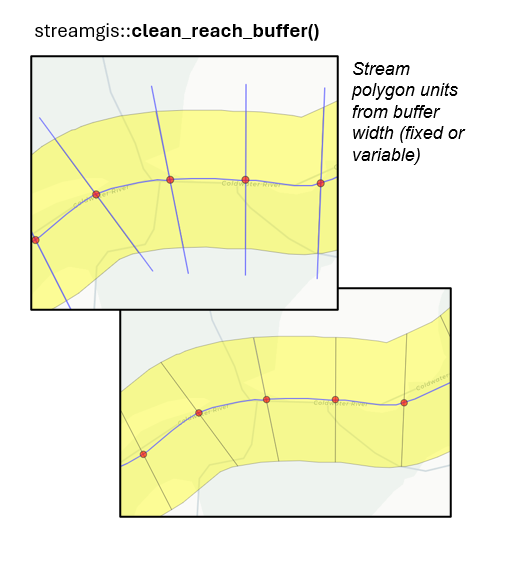
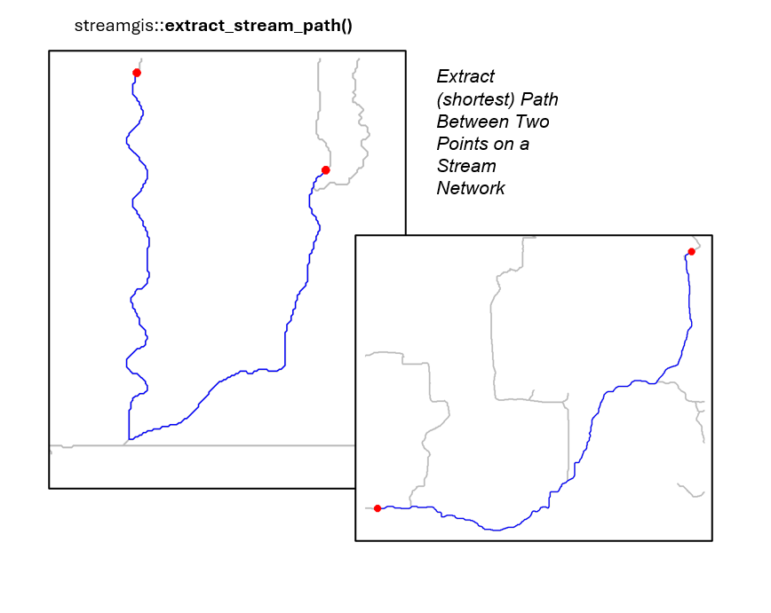
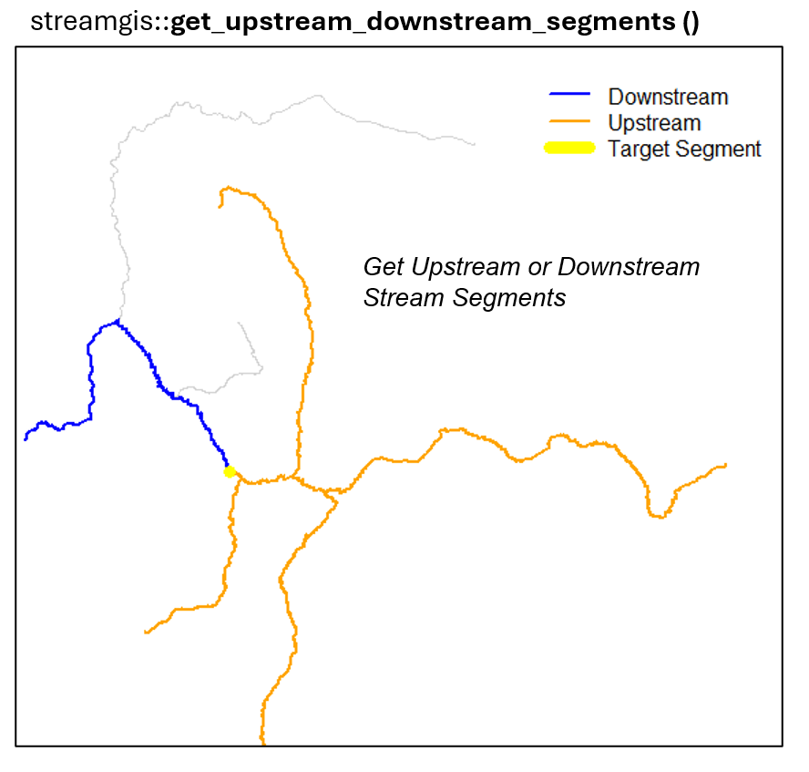
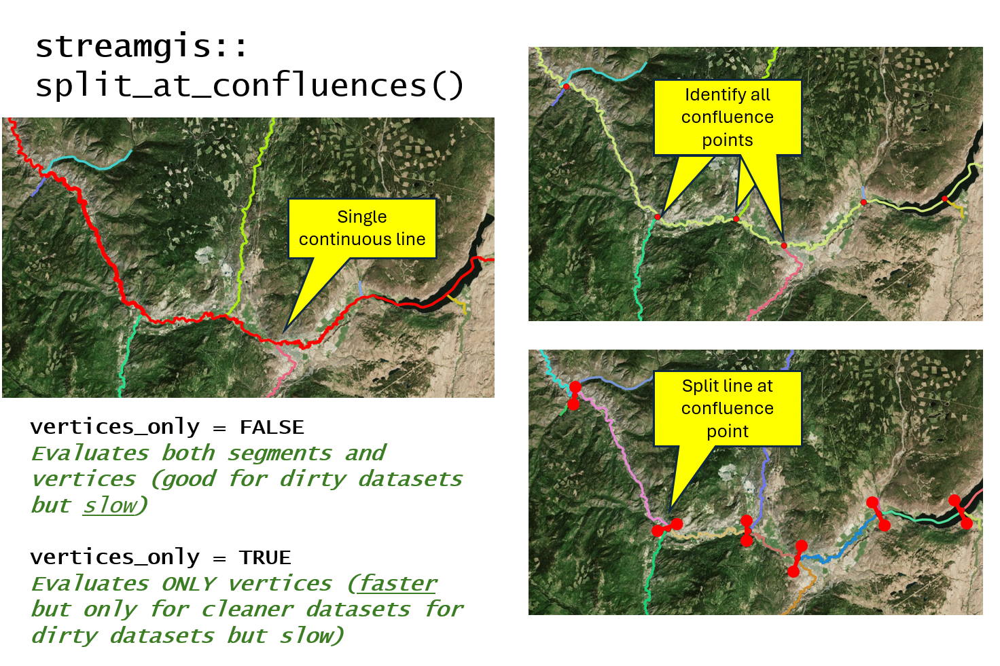
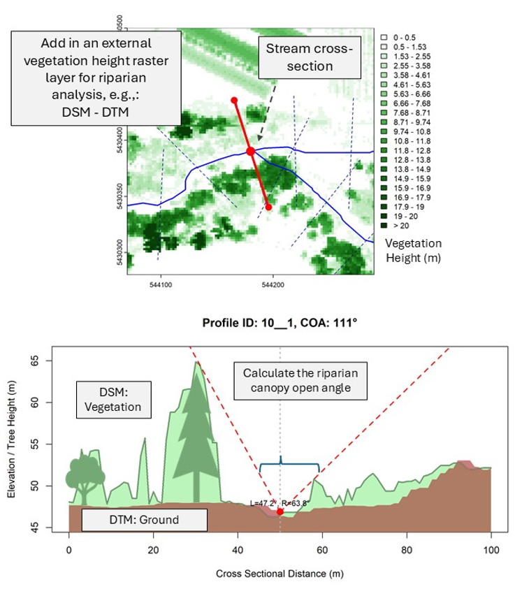

# streamgis

[](https://cran.r-project.org/package=streamgis)

streamgis is an R package for spatial analysis of streams and riparian ecosystems. It's designed to help hydrologists, environmental scientists, and watershed managers analyze stream networks, riparian habitats, and aquatic ecosystems using GIS data.

The package provides specialized tools for:
- Sampling stream centerlines at regular intervals
- Creating cross-sectional profiles perpendicular to streams
- Analyzing vegetation and canopy cover (important for predicting stream temperature impacts on fish)
- Delineating riparian zones with clean buffers
- Stream network operations (path extraction, upstream/downstream traversal, confluence splitting)
- Integrating external spatial data (land use, infrastructure, etc.)

It's built on modern R spatial libraries (sf, terra, sfnetworks) and is particularly useful for stream temperature modeling, habitat assessment, and watershed management workflows.

### Installation

`remove.package("streamgis")`
`devtools::install_github("mattjbayly/streamgis")`

### Commonly-used Functions and Workflow

* `points_on_line()` Samples points on stream center line.

* `cross_section_lines()` Create perpendicular Cross-Section Lines.

* `sample_profiles_and_canopy_angle()` Calculate canopy open angle with vegetation height raster or DSM - DTM product.

* `clean_reach_buffer()` Clean buffer along stream cut by cross sections.

* `extract_stream_path()` Extract the stream path between two points on a network.

* `get_upstream_downstream_segments()` Get all upstream or downstream segments from a target location.

* `split_at_confluences()` Split stream lines at confluence points.

* `split_lines_at_points()` Split lines at user-specified point locations.

* `bcfwa_geometry()` Get the x,y,z geometry from BCFWA streamlines.


### Points and Cross-Sectional Profiles

The `points_on_line()` and `cross_section_lines()` functions form the foundation for stream-based spatial analysis. They allow you to systematically sample locations along stream centerlines and create perpendicular transects for habitat assessment, channel morphology studies, and riparian analysis.

**`points_on_line()`** samples points at regular intervals along stream centerlines. Similar to QChainage in QGIS, but handles multipart and multi-feature line geometry. Each point includes metadata for the line ID, point index, group (start/sample/end), and distance along the line.

**`cross_section_lines()`** generates perpendicular cross-sectional lines at each sample point. The function calculates the bearing of the streamline at each point and creates transects of a specified width. These cross-sections are essential for analyzing stream channel characteristics, riparian vegetation, and solar exposure.

```r
library(streamgis)

# Load stream centerline
fname <- system.file("extdata", "center_line.gpkg", package = "streamgis")
center_line <- sf::st_read(fname, quiet = TRUE)

# Sample points every 100m along the centerline
pts <- points_on_line(center_line, point_spacing = 100, epsg = 26910)

# Create 250m wide cross-sectional profiles at each point
cross_sections <- cross_section_lines(
  center_line = center_line,
  points = pts,
  cross_profile_length = 250,
  epsg = 26910
)

# Visualize results
plot(sf::st_geometry(center_line), col = "blue", lwd = 2)
plot(sf::st_geometry(cross_sections), col = "grey", add = TRUE)
plot(sf::st_geometry(pts), col = "red", pch = 19, cex = 0.5, add = TRUE)
```




### Clean Reach Buffers

The `clean_reach_buffer()` function creates variable-width buffers around stream centerlines that are neatly clipped to reach endpoints using the cross-sectional profiles. This is useful for delineating riparian zones, sampling areas, or habitat polygons that respect stream reach boundaries.

```r
# Create clean buffers using cross sections as boundaries
buffers <- clean_reach_buffer(
  center_line = center_line,
  buffer_width = 50,  # 50m buffer on each side
  cross_section_lines = cross_sections,
  epsg = 26910
)

plot(sf::st_geometry(buffers), col = "lightgreen", border = "darkgreen")
plot(sf::st_geometry(center_line), col = "blue", lwd = 2, add = TRUE)
```




### Stream Network Operations

The following functions provide tools for working with stream network topology, including path extraction, network traversal, and line splitting operations.

#### Extract Stream Path

`extract_stream_path()` finds the shortest path between two points on a stream network. It snaps the input points to the nearest streamlines, creates a network graph using `sfnetworks`, and extracts the connecting line segments. This is useful for calculating stream distances, delineating study reaches, or extracting channel segments between monitoring stations.

```r
# Load stream network and sample points
lines_path <- system.file("extdata", "clip_points/clip_lines.gpkg", package = "streamgis")
points_path <- system.file("extdata", "clip_points/clip_points.gpkg", package = "streamgis")
streams <- sf::st_read(lines_path, quiet = TRUE)
points <- sf::st_read(points_path, quiet = TRUE)

# Select two points
target_pts <- points[points$NAME == "PEP8", ]
point_1 <- target_pts[1, ]
point_2 <- target_pts[2, ]

# Extract the stream path between points
path <- extract_stream_path(streams, point_1, point_2)

# Visualize
plot(sf::st_geometry(streams), col = "grey")
plot(sf::st_geometry(path), col = "red", lwd = 3, add = TRUE)
plot(sf::st_geometry(point_1), col = "blue", pch = 19, cex = 2, add = TRUE)
plot(sf::st_geometry(point_2), col = "green", pch = 19, cex = 2, add = TRUE)
```




#### Get Upstream/Downstream Segments

`get_upstream_downstream_segments()` traverses the stream network to find all segments upstream or downstream of a target location. The function uses directed graph traversal based on line geometry direction. This is essential for watershed delineation, cumulative effects assessment, or identifying contributing stream reaches.

```r
# Load BC Freshwater Atlas data
fname <- system.file("extdata", "bcfwa2.gpkg", package = "streamgis")
bcfwa <- sf::st_read(fname, quiet = TRUE)

# Find target segment by attribute
target <- which(bcfwa$LINEAR_FEATURE_ID == 701771373)

# Get downstream segments (reverse_direction=TRUE for BCFWA data)
downstream <- get_upstream_downstream_segments(
  bcfwa,
  target = target,
  direction = "downstream",
  reverse_direction = TRUE
)

# Get upstream segments
upstream <- get_upstream_downstream_segments(
  bcfwa,
  target = target,
  direction = "upstream",
  reverse_direction = TRUE
)

# Visualize network connectivity
plot(sf::st_geometry(bcfwa), col = "grey")
plot(sf::st_geometry(downstream), col = "blue", lwd = 2, add = TRUE)
plot(sf::st_geometry(upstream), col = "red", lwd = 2, add = TRUE)
plot(sf::st_geometry(bcfwa[target, ]), col = "yellow", lwd = 4, add = TRUE)
```




#### Split at Confluences

`split_at_confluences()` identifies confluence points (where tributaries join main stems) and splits stream lines at those locations. This ensures all line features terminate or start at confluence nodes rather than passing through them - a requirement for proper network topology. The function handles complex cases including self-intersecting lines and near-return patterns.

```r
# Split streams at all confluence points
result <- split_at_confluences(streams, tolerance = 0.1, snap_tolerance = 5)

# Access results
split_lines <- result$lines
confluences <- result$confluences

# Visualize
plot(sf::st_geometry(split_lines), col = "blue")
plot(sf::st_geometry(confluences), col = "red", pch = 19, add = TRUE)

# Check split statistics
cat("Original lines:", nrow(streams), "\n")
cat("Split lines:", nrow(split_lines), "\n")
cat("Confluence points:", nrow(confluences), "\n")
```





#### Split Lines at Points

`split_lines_at_points()` splits line features at user-specified point locations. Points are snapped to the nearest line within a tolerance distance, and lines are split at those snapped locations. Points that snap to existing line endpoints do not trigger a split. This is useful for subdividing streams at monitoring stations, barriers, or other point features.

```r
# Create split points
split_pts <- sf::st_sf(
  id = 1:2,
  geometry = sf::st_sfc(
    sf::st_point(c(540900, 5429800)),
    sf::st_point(c(541000, 5430000)),
    crs = sf::st_crs(streams)
  )
)

# Split lines at point locations
result <- split_lines_at_points(
  streams,
  split_pts,
  snap_tolerance = 10,
  endpoint_tolerance = 0.5
)

split_lines <- result$lines
snapped_pts <- result$points

# Check which points triggered splits
snapped_pts[, c("snapped", "split_performed", "at_endpoint")]
```


### Riparian Analysis

We can bring the functions together in a useful way to calculate various riparian habitat metrics. For example, starting with our stream center line we can use the `points_on_line()`function to sample points along streamline at a specified distance (e.g., sample a point every 20m). `points_on_line()`is similar to QChainage in QGIS, but can work with line geometry that is multipart or has multiple features. After we have sampled our points we can run `cross_section_lines()`to generate cross-sectional profiles along our streamline layer. We can specify the width and other arrtibutes. `cross_section_lines()` returns the bearing of the cross section and streamline. These attributes are useful when thinking about aspect and solar exposure.

Finally, once we have our cross-sectional profiles from `cross_section_lines()`, we can bring in external tree height data, and/or DSM/DTMs (digital surface models / digital terrain models). We can then leverage the `sample_profiles_and_canopy_angle()`to sample points along each cross sectional profile to generate a cross-sectional elevation profile. We can specify point spacing, vertical offsets and other attributes for stream cross sectional analysis. Various other programs like HEC-RAS allow for similar functionality, but `sample_profiles_and_canopy_angle()` may come in useful for custom analyses.

The following example provides similar functionality to [Seixas et al., 2018: Historical and Future Stream Temperature Change Predicted by a Lidar-Based Assessment of Riparian Condition and Channel Width](https://onlinelibrary.wiley.com/doi/10.1111/1752-1688.12655?utm_source=researchgate)

[](https://onlinelibrary.wiley.com/doi/10.1111/1752-1688.12655?utm_source=researchgate)


### Installation

'streamgis' is only available on GitHub.

The development version can be installed in R with the following code:

`devtools::install_github("mattjbayly/streamgis")`
